# 🚗 Servix Auto - Agendamento de Oficina

O Servix Auto é um sistema web para gerenciamento de serviços em uma oficina mecânica. Ele permite o cadastro de clientes, profissionais, serviços e, principalmente, o agendamento e consulta desses serviços.

Este projeto foi desenvolvido como um trabalho acadêmico.

## ✨ Funcionalidades Principais

* **Gestão de Clientes:** CRUD (Criar, Ler, Atualizar, Deletar) de clientes.
* **Gestão de Profissionais:** CRUD de mecânicos e outros funcionários.
* **Gestão de Serviços:** CRUD dos serviços oferecidos pela oficina.
* **Sistema de Agendamento:** Permite marcar, consultar e editar os agendamentos, vinculando clientes, profissionais e serviços.
* **Relatórios:** Geração de relatórios (ex: serviços agendados).

## 🛠️ Tecnologias Utilizadas

* **PHP:** Linguagem principal (backend).
* **MySQL:** Banco de dados para armazenamento dos dados.
* **HTML5 e CSS3:** Estruturação e estilização das páginas.
* **SQL:** Linguagem de consulta para o banco de dados.

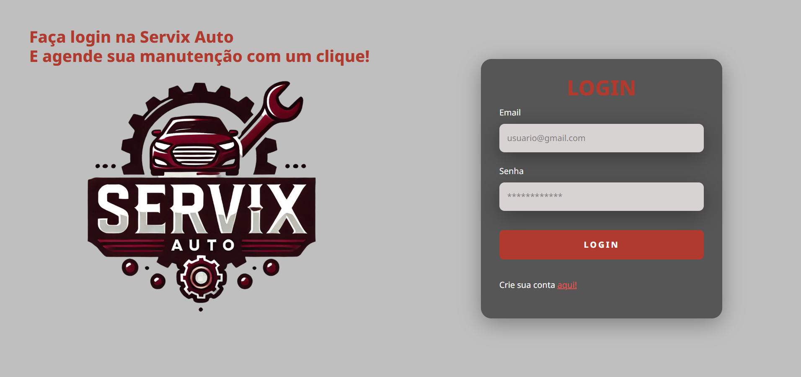
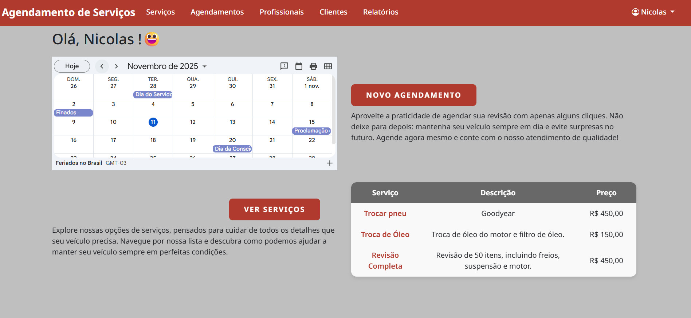
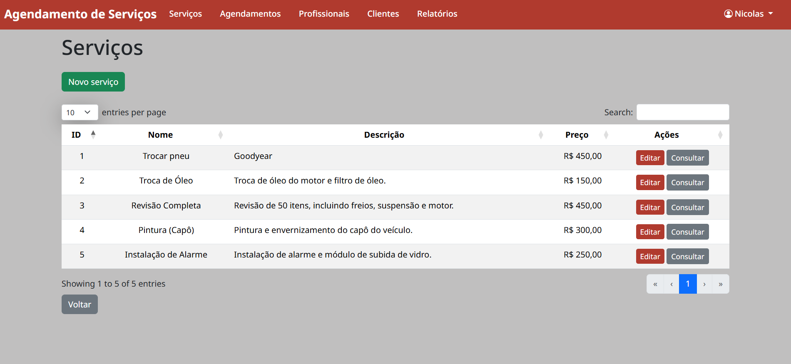
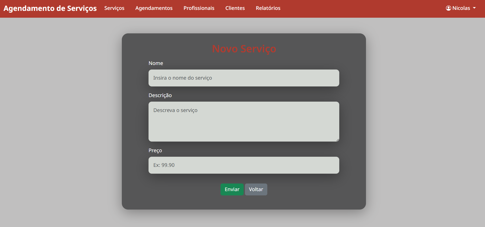

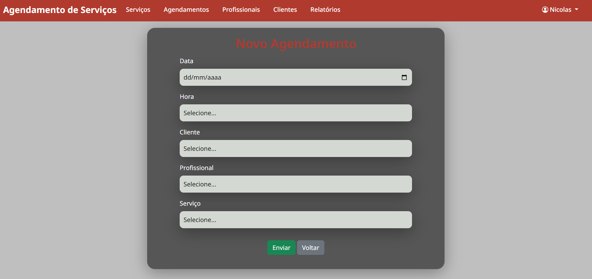
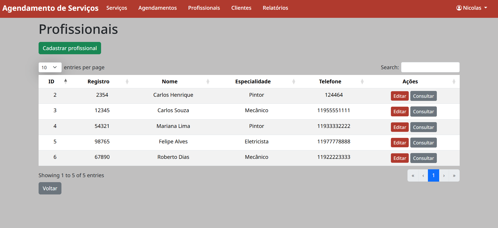
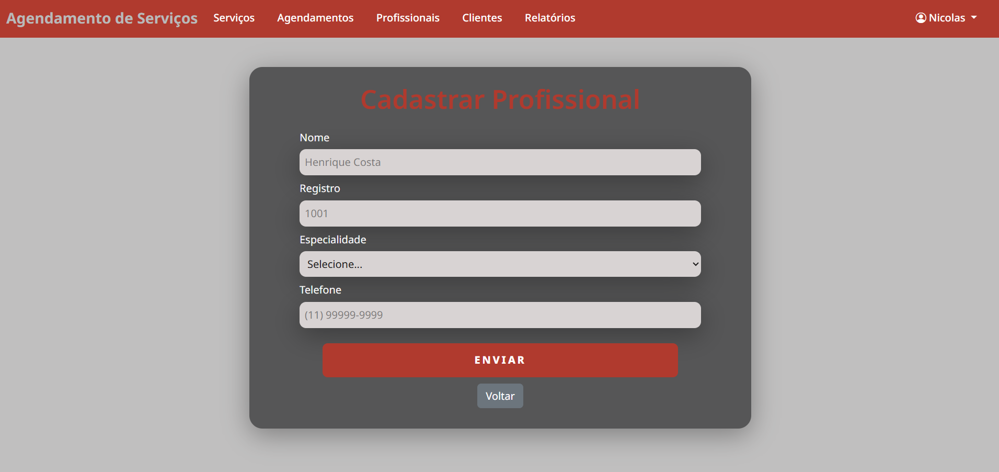
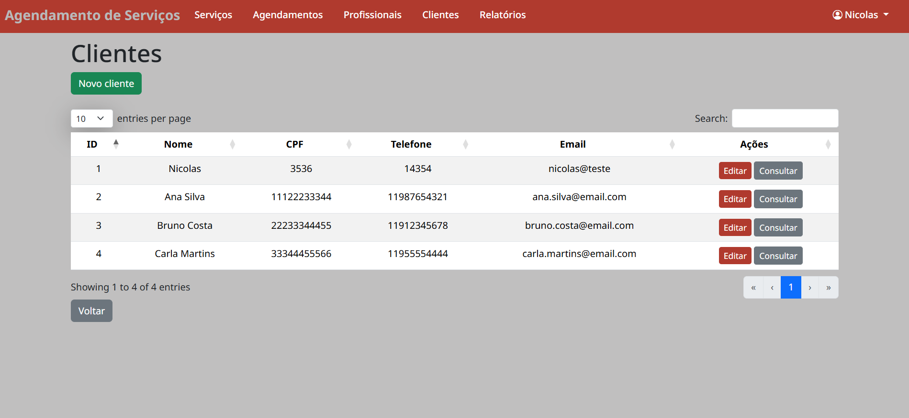
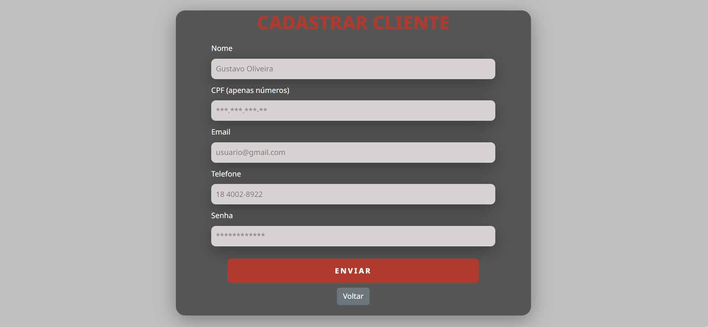
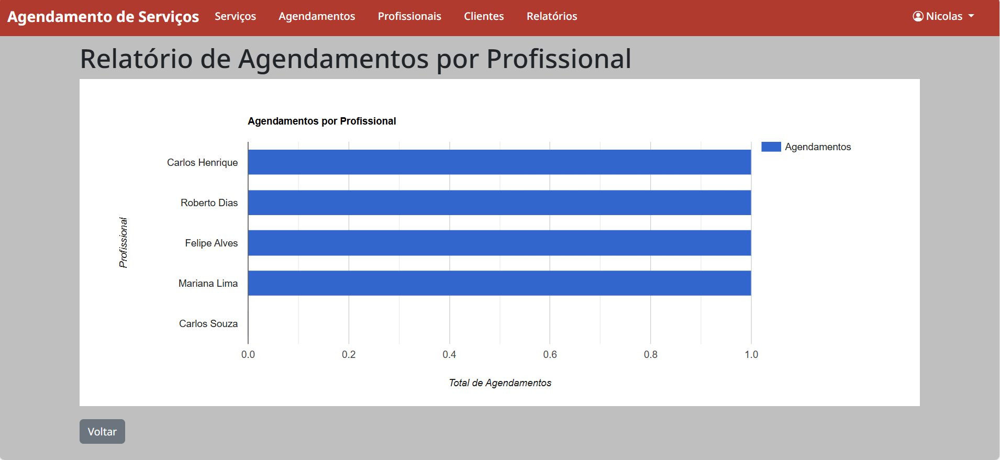
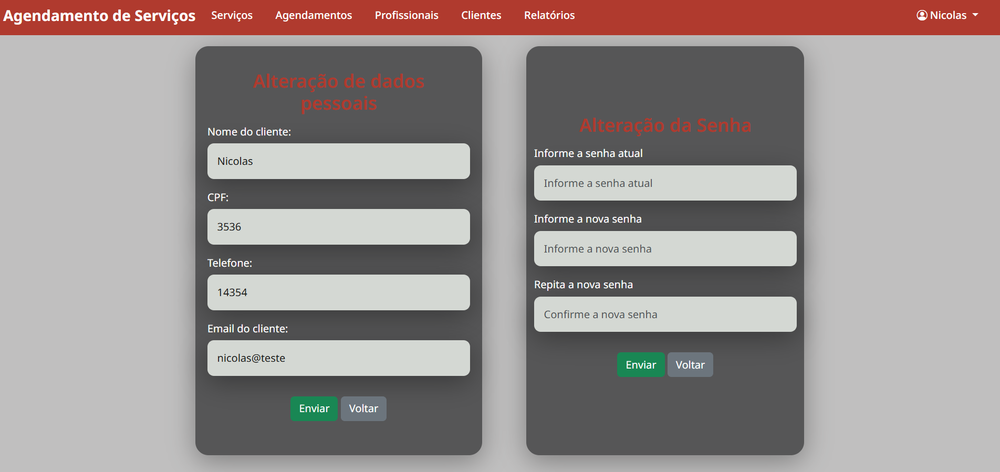
